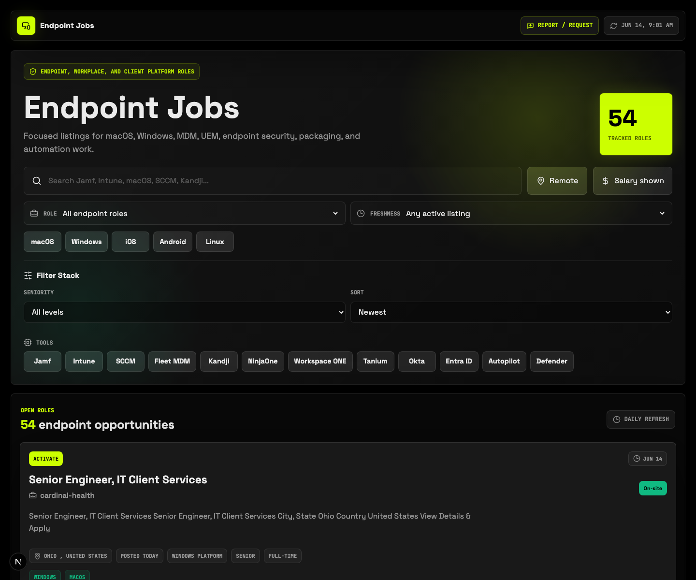
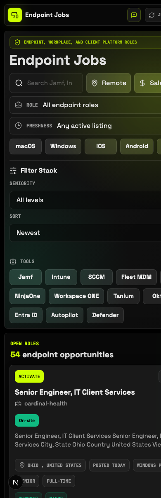

# Endpoint Jobs

Focused job board for Endpoint Engineering, macOS, Windows, MDM, UEM, client platform, and endpoint security roles.

Live site: https://endpointjobs.dev

## Screenshots

| Desktop | Mobile |
| --- | --- |
|  |  |

## How The Page Works

Endpoint Jobs is a static Next.js app backed by `src/data/jobs.json`. The first screen is the job board, not a marketing page.

Users can:

- Search across title, company, location, summary, description, tags, tools, and platforms.
- Toggle `Remote` and `Salary shown` for high-signal narrowing.
- Filter by role family, freshness, platform, seniority, and endpoint tools.
- Sort by newest, compensation, or company.
- Expand long descriptions when providers expose useful details beyond the summary.
- Open job applications directly from each listing.
- Use `Report / request` to open a GitHub issue for bugs or feature requests.

## How Jobs Are Populated

The feed is generated by `npm run jobs:refresh`.

```text
GitHub Action or local command
-> scripts/refresh-jobs.ts
-> provider adapters in scripts/job-refresh/providers
-> endpoint relevance filtering, normalization, dedupe, salary extraction
-> src/data/jobs.json
-> Next.js static build
-> Vercel deployment
```

The refresh script keeps the site cheap to host: there is no database, queue, or runtime job API dependency for visitors. It writes normalized jobs into `src/data/jobs.json`, and the page imports that JSON at build time.

Current default public providers: Remotive, Arbeitnow, Jobicy, Remote OK, Greenhouse, Lever, The Muse, Ashby, Amazon Jobs, Workday, Jibe, and Activate.

Optional configured providers: Workable, Techmap RSS, Adzuna, TheirStack, and SerpAPI Google Jobs.

The normalizer:

- Filters for endpoint/macOS/Windows/MDM/UEM/client platform relevance.
- Infers workplace, seniority, role family, tools, platforms, and match reasons.
- Extracts useful long descriptions when available.
- Extracts annual salary ranges from provider descriptions when structured salary fields are missing.
- De-dupes equivalent jobs and drops stale listings.

## Run Locally

```bash
npm install
npm run dev
```

## Refresh Jobs Locally

```bash
npm run jobs:refresh
```

Use `JOB_PROVIDERS=remotive,arbeitnow,jobicy,remoteok,greenhouse,lever,muse,ashby,workable,amazon,workday,jibe,activate,techmaprss,adzuna,theirstack,serpapi` to choose sources.

Single-provider legacy mode still works with `JOB_PROVIDER=remoteok` and `JOB_API_URL=https://remoteok.com/api`.

Override individual URLs with `JOB_REMOTIVE_API_URL`, `JOB_ARBEITNOW_API_URL`, `JOB_JOBICY_API_URL`, `JOB_REMOTEOK_API_URL`, `JOB_GREENHOUSE_API_URL`, `JOB_LEVER_API_URL`, `JOB_MUSE_API_URL`, `JOB_ASHBY_API_URL`, `JOB_WORKABLE_API_URL`, `JOB_AMAZON_API_URL`, `JOB_WORKDAY_API_URL`, `JOB_JIBE_API_URL`, `JOB_ACTIVATE_API_URL`, `JOB_TECHMAP_RSS_API_URL`, `JOB_ADZUNA_API_URL`, `JOB_THEIRSTACK_API_URL`, or `JOB_SERPAPI_API_URL`.

Career-board defaults include Greenhouse boards for Jamf, Automox, Tanium, Okta, PlayStation, Verkada, Anthropic, DoorDash, Commvault, Kaseya, and Kymera; Lever companies JumpCloud, Brighton Jones, Hermeus, and Omnidian; Ashby board Docker; targeted Amazon, Workday, Jibe, and Activate searches; and `JOB_MUSE_PAGES=5`.

Workable uses `JOB_WORKABLE_ACCOUNTS=slug` or `Display Name|slug` entries, with optional `JOB_WORKABLE_DETAIL_API_URL` for v1 detail overrides.

Techmap RSS uses `JOB_TECHMAP_RSS_FEEDS=url` or `Feed Name|url` entries, with optional `JOB_TECHMAP_RSS_AUTH_HEADER` or `TECHMAP_RSS_TOKEN`.

Adzuna defaults to US searches from `JOB_ADZUNA_QUERIES`. TheirStack requires `THEIRSTACK_API_KEY` and supports `JOB_THEIRSTACK_TITLE_QUERIES`, `JOB_THEIRSTACK_COUNTRY_CODES`, `JOB_THEIRSTACK_MAX_AGE_DAYS`, and `JOB_THEIRSTACK_LIMIT`. SerpAPI Google Jobs requires `SERPAPI_API_KEY` and supports `JOB_SERPAPI_QUERIES`, `JOB_SERPAPI_LOCATION`, `JOB_SERPAPI_GL`, `JOB_SERPAPI_HL`, and `JOB_SERPAPI_MAX_PAGES`.

## GitHub Action

`.github/workflows/refresh-jobs.yml` runs daily at `11:17 UTC` and can also be run manually with `workflow_dispatch`.

It installs dependencies, runs `npm run jobs:refresh`, verifies `npm run build`, commits `src/data/jobs.json` when listings change, and pushes back to `main`.

## Vercel

1. Import the GitHub repo in Vercel.
2. Framework preset: Next.js.
3. Build command: `npm run build`.
4. Keep Git integration enabled so feed commits redeploy automatically.
