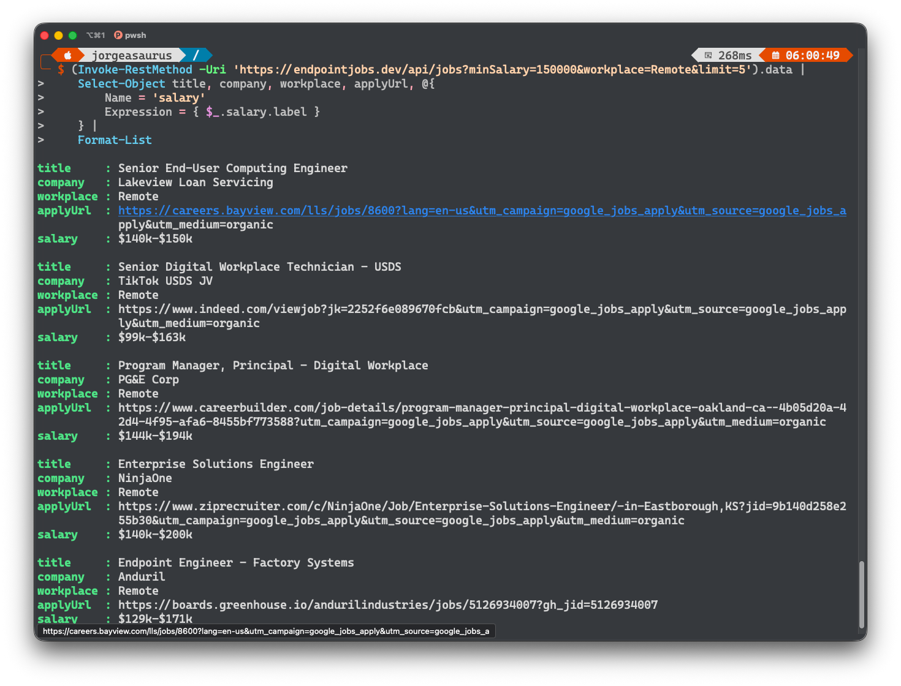

# Jobs API

Base URL: `https://endpointjobs.dev`

The API is public, read-only, and requires no authentication. It returns active listings from the same normalized feed used by the job board.

Machine-readable contract: [`/openapi.json`](https://endpointjobs.dev/openapi.json)

## List jobs

```http
GET /api/jobs?tools=Jamf&platforms=macOS&minSalary=150000&page=1&limit=20
```

```json
{
  "data": [{ "id": "...", "title": "Endpoint Engineer" }],
  "filters": {
    "q": null,
    "platforms": ["macOS"],
    "tools": ["Jamf"],
    "location": null,
    "workplace": null,
    "salaryShown": false,
    "leadership": false,
    "minSalary": "150000",
    "seniority": null,
    "family": null,
    "freshness": null,
    "sort": "newest"
  },
  "meta": {
    "page": 1,
    "limit": 20,
    "total": 30,
    "totalPages": 2,
    "updatedAt": "2026-07-12T22:35:39.294Z"
  }
}
```

| Parameter | Values |
| --- | --- |
| `q` | Search text, 1–200 characters |
| `platforms` | Comma-separated: `macOS`, `Windows`, `iOS`, `Android`, `Linux` |
| `tools` | Comma-separated endpoint tools, such as `Jamf`, `Intune`, or `SCCM` |
| `location` | City, state, or country text, 1–200 characters |
| `workplace` | `Remote`, `Hybrid`, or `On-site` |
| `salary` | `1` to require disclosed compensation |
| `leadership` | `1` to require leadership roles |
| `minSalary` | USD floor: `80000`, `100000`, `120000`, `150000`, `180000`, `200000` |
| `seniority` | `Associate`, `Mid`, `Senior`, `Staff`, `Lead`, or `Manager` |
| `family` | Role family listed in the OpenAPI enum |
| `freshness` | Posted within `1`, `7`, `14`, or `30` days |
| `sort` | `newest`, `salary`, or `company` |
| `page` | Positive integer; default `1` |
| `limit` | `1`–`100`; default `20` |

Repeated or unknown parameters are rejected. Multi-value filters use one comma-separated parameter, not repeated keys.

## PowerShell

List jobs:

```powershell
$response = Invoke-RestMethod -Uri 'https://endpointjobs.dev/api/jobs?limit=2'
$response.data | Select-Object id, title, company, location
```

```text
id                                                          title                              company          location
--                                                          -----                              -------          --------
workday-the-hartford-avp-end-user-engineering-08f75aba96     AVP, End User Engineering          The Hartford     Hartford, CT
activate-cardinal-health-f989d26e-7ca3-4899-9350-9c5b3a3a1023 Senior Analyst, IT Client Services Cardinal Health  Overland Park, Kansas...
```

Filter and paginate:

```powershell
$uri = 'https://endpointjobs.dev/api/jobs?tools=Jamf&platforms=macOS&minSalary=150000&page=1&limit=20'
$response = Invoke-RestMethod -Uri $uri
$response.meta
$response.data | Select-Object title, company, location
```

```text
page limit total totalPages updatedAt
---- ----- ----- ---------- ---------
   1    20    10          1 2026-07-12T22:35:39.294Z

title                       company  location
-----                       -------  --------
IT Systems Engineer         Intercom San Francisco, California
Senior IT Systems Engineer  Intercom San Francisco, California
```

Show application links and nested salary labels:

```powershell
$uri = 'https://endpointjobs.dev/api/jobs?minSalary=150000&workplace=Remote&limit=20'
$response = Invoke-RestMethod -Uri $uri
$response.data |
    Select-Object title, company, location, applyUrl, @{
        Name = 'salary'
        Expression = { $_.salary.label }
    } |
    Format-List
```

```text
title    : Senior End-User Computing Engineer
company  : Lakeview Loan Servicing
location : Coral Gables, FL
applyUrl : https://careers.bayview.com/lls/jobs/8600?lang=en-us&utm_campaign=google_jobs_apply...
salary   : $140k-$150k

title    : Senior Digital Workplace Technician - USDS
company  : TikTok USDS JV
location : Washington, DC
applyUrl : https://www.indeed.com/viewjob?jk=2252f6e089670fcb&utm_campaign=google_jobs_apply...
salary   : $99k-$163k

...
```

Example terminal output using `limit=5`:



Fetch one job from the collection:

```powershell
$jobId = $response.data[0].id
$job = Invoke-RestMethod -Uri "https://endpointjobs.dev/api/jobs/$jobId"
$job.data | Select-Object id, title, company, location, workplace, tools, platforms
```

```text
id         : greenhouse-intercom-7918638
title      : IT Systems Engineer
company    : Intercom
location   : San Francisco, California
workplace  : Hybrid
tools      : {Jamf, Intune, Okta}
platforms  : {Windows, macOS}
```

Outputs were captured from the live API on July 13–14, 2026 and will change as listings refresh. Long URLs are shortened in the examples.

## Get one job

```http
GET /api/jobs/{id}
```

Returns `{ "data": Job, "meta": { "updatedAt": "..." } }`. Inactive, expired, excluded, and unknown IDs return `404`.

## Errors

```json
{
  "error": {
    "code": "INVALID_QUERY",
    "message": "One or more query parameters are invalid.",
    "details": ["limit must be an integer between 1 and 100"]
  }
}
```

| Status | Code |
| --- | --- |
| `400` | `INVALID_QUERY` |
| `404` | `JOB_NOT_FOUND` |

## Caching and CORS

Successful responses use `Cache-Control: public, s-maxage=300, stale-while-revalidate=3600`. Errors use `no-store`. Cross-origin `GET` requests are allowed with `Access-Control-Allow-Origin: *`.
